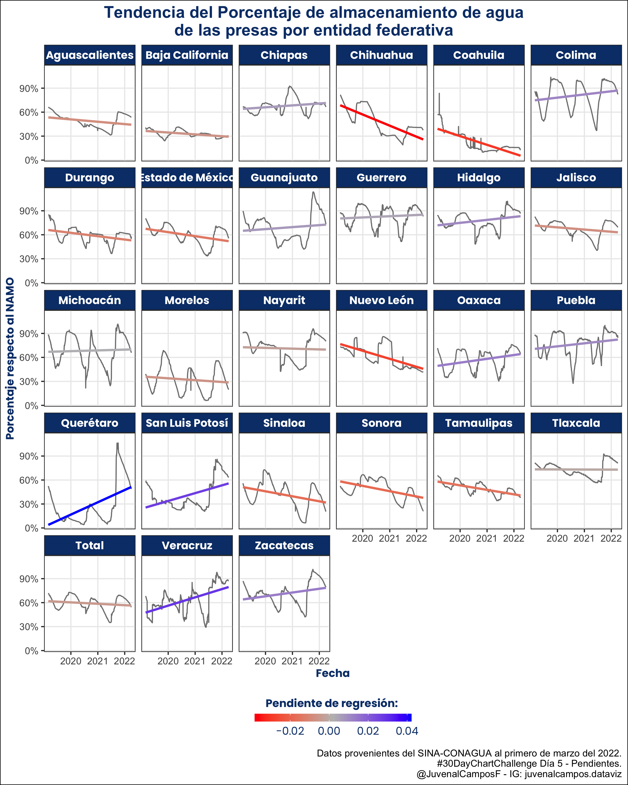

# 30DayChartChallenge2022
Repositorio de gráficas del #30DayChartChallenge 2022.

Por motivos de agenda laboral y una sobresaturación de trabajo durante la segunda mitad del mes, en esta edición tuve una menor participación en el reto. A continuación muestro varias de las gráficas generadas durante este 2022.

## Day 01. Part to whole

En esta visualización generé una gráfica de dona para mostrar los principales estados productores de durazno. La gráfica fue hecha con `ggplot2` y la postproducción en **Keynote**. La fuente principal fueron los datos del SIAP. En 2020, el estado de Chihuahua produjo **uno de cada cinco** duraznos en México.

## Day 02. Pictogram

La visualización de este día analiza el simulacro de la revocación de mandato realizado a mitad del sexenio 2018–2024 en la Facultad de Ciencias Políticas y Sociales de la UNAM. La gráfica muestra:  
a) la gran proporción de alumnos a favor de que el presidente se mantuviera en su mandato, y  
b) el **bajísimo** nivel de participación obtenido.  
Esto ya anticipaba el bajo nivel de participación en el ejercicio real (y en otros procesos convocados por el gobierno).

## Day 03. Historical

En *Historical*, y preparando una clase para semanas posteriores, hice una **línea del tiempo** sobre la evolución de la visualización de datos, desde los **antiguos** cartógrafos hasta la era moderna.

**De los mapas antiguos al dashboard: una breve historia de las visualizaciones**

> La visualización de datos no nació con las computadoras. Sus raíces se hunden en los antiguos cartógrafos (200 a. C. – 1800), quienes transformaron información geográfica y política en mapas que permitían navegar, comerciar y gobernar. Ese impulso por “ver” la información siguió con Nicolás Oresme (siglo XIV), que esbozó uno de los primeros usos de ejes para representar magnitudes variables.

> A finales del siglo XVIII, William Playfair dio un salto decisivo al inventar formatos hoy cotidianos: líneas, barras y pastel para mostrar comercio, precios y balanzas. Pocos años después, Charles Dupin popularizó el mapa coroplético, pintando regiones según su nivel de alfabetización.

> En el siglo XIX, Charles Joseph Minard llevó la síntesis visual a otro nivel con sus diagramas de flujo —famosamente, la campaña de Napoleón— donde cantidad, distancia, temperatura y tiempo conviven en una sola pieza. Casi en paralelo, John Snow mapeó casos de cólera en Londres e identificó la bomba responsable: una victoria temprana de la epidemiología basada en datos. Florence Nightingale demostró que el diseño persuade: su “rosa” o coxcomb evidenció muertes evitables en la guerra de Crimea. Francis Galton aportó el diagrama de dispersión y la correlación, abriendo la puerta a la estadística moderna aplicada. Ya en el siglo XX, Mary Eleanor Spear sistematizó reglas prácticas de claridad y elección de gráficos.

> Desde los años 80 hasta hoy, la “era moderna” democratizó estas ideas. Herramientas como Excel, y lenguajes como R y Python (ggplot2, matplotlib, bibliotecas interactivas, BI y dashboards) permiten pasar de datos crudos a relatos visuales en minutos. El reto actual no es solo dibujar cifras: es elegir el gráfico correcto, contar una historia honesta y diseñar para la comprensión y la acción.

> En resumen, la línea del tiempo de la visualización es una cadena de innovaciones que combinan ciencia, diseño y propósito público. Ver bien es entender mejor.

## Day 04. Floral

Con datos del SIAP, hice una gráfica radial donde la altura de cada “pétalo” representa el valor total de la producción de cada tipo de flor registrada en la base.

## Day 05. Slope

Para sintetizar la tendencia reciente del llenado de presas, estimé la pendiente de una regresión lineal simple por entidad federativa usando los últimos cuatro años disponibles (hasta la fecha de elaboración).

La **línea gris** muestra la serie de porcentaje de almacenamiento a lo largo del tiempo.  
La **línea de color** es la tendencia estimada (pendiente):

* **Azul**: pendiente positiva → niveles en aumento.  
* **Rojo**: pendiente negativa → niveles en descenso.

La **intensidad** del color refleja la magnitud del cambio.  
Una pendiente cercana a cero sugiere estabilidad.

> **Nota metodológica.** La regresión lineal es un resumen descriptivo —útil para comparar entidades de forma rápida—, pero no es el mejor método para series con estacionalidad o cambios de régimen. Debe interpretarse como señal de tendencia, no como pronóstico de escasez.

## Day 06. OWID

Para este día se invitó a visualizar datos de *Our World in Data*. Elegí la **vacunación contra COVID-19** en el mundo hasta abril de 2022. Con estos datos elaboré un **cartograma de Dorling**: el tamaño de cada círculo representa el número de vacunas aplicadas, relacionado tanto con la inversión pública como con el tamaño de la población de cada país.

## Day 07. Physical

Dadas las características **físicas** de los **Pokémon**, utilicé la **PokéAPI** para graficar la relación entre **peso** y **altura** y obtener la distribución de estas variables para los Pokémon disponibles hasta la fecha (generación de Galar).

## Day 08. Mountains

Con el mismo estilo de la visualización anterior, se muestra la distribución en **latitud** y **longitud** de las montañas a lo largo de México. Se observa **cómo** se concentran en el centro del país a lo largo del **eje X** y **cómo** aparecen dos grandes grupos en el **eje Y** por las montañas del norte y el **Eje Neovolcánico Transversal**.

## Day 09. Statistics

Por las limitaciones de recursos para organizar la *revocación de mandato*, se abrieron menos casillas y aumentó el número de votantes por casilla abierta. Dado que la participación fue baja, no representó un problema operativo. Para el estado de Morelos analicé cuánta gente tendría que ir a votar por sección: en promedio, aumentó en **poco más de 2,000 personas** por sección.

